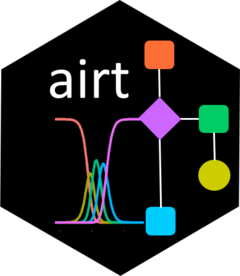

<!-- README.md is generated from README.Rmd. Please edit that file -->

```{r, include = FALSE}
knitr::opts_chunk$set(
  collapse = TRUE,
  comment = "#>",
  fig.path = "man/figures/README-",
  out.width = "100%"
)
```

# airt 
  

<!-- badges: start -->
  [](https://travis-ci.org/sevvandi/airt)
  <!-- badges: end -->
  
The goal of _airt_ is to evaluate algorithm performances using Item Response Theory (IRT). You can use _airt_ to evaluate the performance of a group of algorithms on a collection of test instances.  The IRT model is fitted using the R package __mirt__ . 

## Installation

You can install the released version of airt from [CRAN](https://CRAN.R-project.org) with:

``` r
install.packages("airt")
```

And the development version from [GitHub](https://github.com/) with:

``` r
# install.packages("devtools")
devtools::install_github("sevvandi/airt")
```
## Example
```{r example}
library(airt)
library(ggplot2)
set.seed(1)
algo1 <- sample(1:5, 100, replace = TRUE)
inds1 <- which(algo1 %in% c(4,5))
algo2 <- rep(0, 100)
algo2[inds1] <- sample(4:5, length(inds1), replace = TRUE)
algo2[-inds1] <- sample(1:3, (100-length(inds1)), replace = TRUE)
algo3 <- rep(0, 100)
algo3[inds1] <- sample(1:2, length(inds1), replace = TRUE)
algo3[-inds1] <- sample(3:5, (100-length(inds1)), replace = TRUE)
algorithms <- cbind.data.frame(algo1, algo2, algo3)
mod <- irtmodel(algorithms)

gdf <- prepare_for_plots(mod$model)
ggplot(gdf, aes(Theta, value)) + geom_line(aes(color=Level)) + facet_wrap(.~Algorithm) + ylab("Probability") + ggtitle("Algorithm Trace Lines") + theme_bw()

mod$stability

mod$anomalous
```
We see that _algo3_ is anomalous. That is, it performs well on test instances that others perform poorly. For _algo1_ and _algo_2_,  the highest level of performance P5 is achieved for high values of $\theta$. But for _algo3_ the P5 is achieved for low values of $\theta$.  


## More on _airt_
The pkgdown site describes the functionality of _airt_ : https://sevvandi.github.io/airt/articles//index.html. 

## Acknowledgements
Firstly, thanks to Rob Hyndman for coming up with the name _airt_, which is an old Scottish word meaing _to guide_. Also, a big thank you to Patricia Menendez Galvan for patiently giving me feedback on how to improve the hex sticker. Nishka and Sashenka Fernando also helped a lot with the design of the hex sticker. Finally, where did I get the hex sticker template from? From Emi Tanaka's blogpost https://emitanaka.org/post/hexsticker/. Thanks Emi. 
