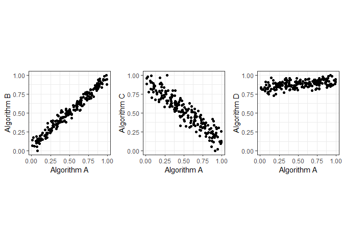
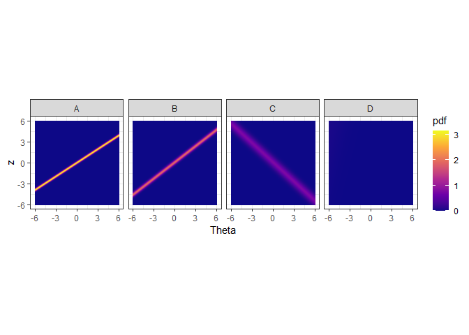
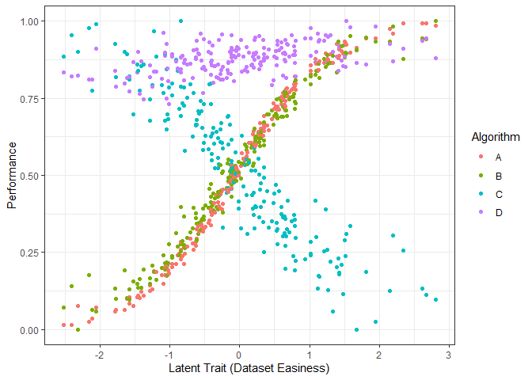
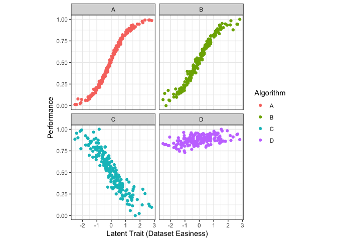
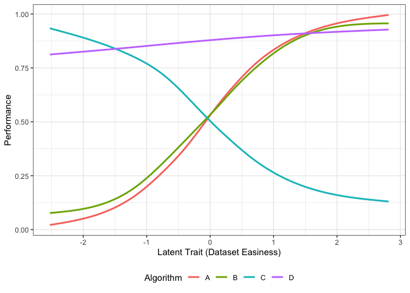
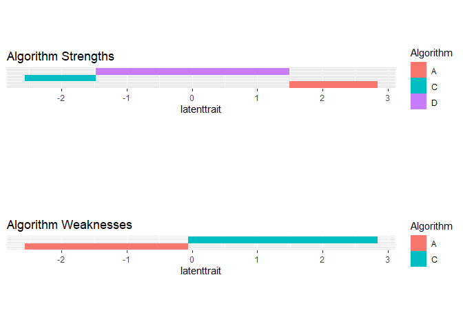

<!-- README.md is generated from README.Rmd. Please edit that file -->

# airt 

<!-- badges: start -->

[](https://github.com/sevvandi/airt/actions)
<!-- badges: end -->

The goal of *airt* is to evaluate algorithm performances using Item
Response Theory (IRT). You can use *airt* to evaluate the performance of
a group of algorithms on a collection of test instances. The polytomous
IRT model is fitted using the R package *mirt* and the continuous IRT
model is fitted using updates to the code in *EstCRM*.

## Installation

You can install the released version of airt from
[CRAN](https://CRAN.R-project.org) with:

``` r
install.packages("airt")
```

You can install the development version from
[GitHub](https://github.com/) with:

``` r
# install.packages("devtools")
devtools::install_github("sevvandi/airt")
```

## Example - continuous

Let us consider some synthetic performance data. In this example the
performance of algorithm A is positively correlated with the performance
of algorithm B, but negatively correlated with the performanc of
algorithm C. Algorithm D is positively correlated with algorithm A.
However, algorithm D has very high performance values.

``` r
library(airt)
library(ggplot2)
library(gridExtra)


set.seed(1)
algo1 <- runif(200)
algo2 <- 2*algo1 + rnorm(200, mean=0, sd=0.1)
algo2 <- (algo2 - min(algo2))/(max(algo2) - min(algo2))

algo3 <- 1 - algo1 + rnorm(200, mean=0, sd=0.1)
algo3 <- (algo3 - min(algo3))/(max(algo3) - min(algo3))

algo4 <- 2 + 0.2*algo1 + rnorm(200, mean=0, sd=0.1)
algo4 <- algo4/max(algo4)


df <- cbind.data.frame(algo1, algo2, algo3, algo4)
colnames(df) <- c("A", "B", "C", "D")
g1 <- ggplot(df, aes(A, B)) + geom_point()+ coord_fixed() + xlab("Algorithm A") + ylab("Algorithm B") + theme_bw()

g2 <- ggplot(df, aes(A, C)) + geom_point() + coord_fixed() + xlab("Algorithm A") + ylab("Algorithm C")  + theme_bw()

g3 <- ggplot(df, aes(A, D)) + geom_point()+  xlab("Algorithm A") + ylab("Algorithm D") + coord_fixed() + ylim(0,1) + theme_bw()
grid.arrange(g1, g2, g3, layout_matrix=cbind(1,2,3))
```



Let us fit a continuous IRT model to this data.

``` r
df2 <- df
max_item  <- max(df2)
min_item <- 0
max.item <- rep(max_item, dim(df2)[2])
min.item <- rep(min_item, dim(df2)[2])
df2 <- as.data.frame(df2)
modout <- cirtmodel(df2, max.item, min.item)
paras <- modout$model$param

gdf <- prepare_for_plots_crm(modout$model) # , thetarange = c(-8, -2)
ggplot(gdf, aes(theta, z)) + geom_raster(aes(fill=pdf))  + xlab("Theta") + facet_wrap(~Algorithm, nrow=1) + coord_fixed(ratio=1) + theme_bw()  +  scale_fill_viridis_c(option = "plasma")
```



The figure above shows the probability density of the fitted IRT model
over Theta and z values. The y axis denotes the normalized performance
values. The high density regions are showed by the lighter coloured
parts. We see that algorithms A and B obtain high performance values for
high Theta values. Theta denotes the dataset easiness. However,
algorithm C obtains high performance values for low Theta values. These
are difficult datasets. Algorithm C gets low performance values for easy
datasets. Algorithm D, does not discriminate among the datasets, as such
it is a stable algorithm.

We can also look at the datasets and their easiness with respect to the
algorithms. This is called the latent trait analysis.

``` r

obj <- latent_trait_analysis(df2,modout$model$param,min.item,max.item, epsilon = 0 )
#> Warning: The `x` argument of `as_tibble.matrix()` must have unique column names if `.name_repair` is omitted as of tibble 2.0.0.
#> Using compatibility `.name_repair`.
#> This warning is displayed once every 8 hours.
#> Call `lifecycle::last_warnings()` to see where this warning was generated.
#> Joining, by = "group"
#> Joining, by = "group"

dfl <- obj$longdf

g1 <- ggplot(dfl, aes(Latent_Trait, value)) +  geom_point(aes(color=Algorithm)) + xlab("Latent Trait (Dataset Easiness)") + ylab("Performance")  + theme_bw() 
g1
```



The figure above shows the performance of the 4 algorithms on different
datasets ordered by dataset easiness. Again, we see that the performance
of algorithms A and B increase with dataset easiness while the
performance of algorithm C decreases with dataset easiness. Even though
the performance of Algorithm D increases with dataset easiness it is
very stable.

``` r

g3 <- ggplot(dfl, aes(Latent_Trait, value)) +  geom_point(aes(color=Algorithm)) + xlab("Latent Trait (Dataset Easiness)") + facet_wrap(~Algorithm, nrow=2) + coord_fixed(ratio=6) + ylab("Performance") + theme_bw() 
g3
```



The above figure shows the performance by algorithm.

``` r

### Curve fitting - smoothing splines - latent trait
g2 <- ggplot(dfl, aes(Latent_Trait, value)) +  geom_smooth(aes(color=Algorithm), se = FALSE, method = "gam", formula = y ~s(x, bs="cs"))+  xlab("Latent Trait (Dataset Easiness)") + ylab("Performance")  + theme_bw()  +theme(legend.position="bottom", legend.box = "horizontal")
# g2
```

We fit smoothing-splines to the performance data by algorithm. The
figure above shows these smoothing splines for each algorithm as a
function of the dataset easiness. From this figure, we can get the best
algorithm for a given dataset easiness. This gives us the proportion of
the latent trait spectrum occupied by each algorithm. We call this the
latent trait occupancy.

``` r
latent <- obj$strengths
latent$proportions
#> # A tibble: 3 x 4
#>   group Proportion algorithm colour 
#>   <dbl>      <dbl> <chr>     <chr>  
#> 1     4      0.87  D         #C77CFF
#> 2     1      0.065 A         #F8766D
#> 3     3      0.065 C         #00BFC4

num_algos <- length(unique(dfl$Algorithm))
colrs <- scales::hue_pal()(num_algos)
 
latenttr <- obj$strengths$multilatent
dfl2 <- tidyr::pivot_longer(latenttr, cols = 2:dim(latenttr)[2])
colnames(dfl2)[2] <- "Algorithm"
dfl2 <- dfl2[dfl2$value!=0, ]
new_vals <- seq(1, length(unique(dfl2$value)), by = 1)
dfl2$value <- new_vals[as.factor(dfl2$value )]
dfl2$value <- dfl2$value*0.1
colrs2 <- colrs[which(sort(unique(dfl$Algorithm)) %in% unique(dfl2$Algorithm))]
g6 <- ggplot(dfl2, aes(x = latenttrait, y =value, fill = Algorithm)) + geom_tile() + theme(axis.title.y=element_blank(), axis.text.y=element_blank(),axis.ticks.y=element_blank())  + scale_fill_manual(values = colrs2) +  ggtitle("Algorithm Strengths") +  coord_fixed(ratio=1)


latenttr2 <- obj$weakness$multilatent
dfl3 <- tidyr::pivot_longer(latenttr2, cols = 2:dim(latenttr)[2])
colnames(dfl3)[2] <- "Algorithm"
dfl3 <- dfl3[dfl3$value!=0, ]
new_vals <- seq(1, length(unique(dfl3$value)), by = 1)
dfl3$value <- new_vals[as.factor(dfl3$value )]
dfl3$value <- dfl3$value*0.1
colrs2 <- colrs[which(sort(unique(dfl$Algorithm)) %in% unique(dfl3$Algorithm))]
g7 <- ggplot(dfl3, aes(x = latenttrait, y =value, fill = Algorithm)) + geom_tile() + theme(axis.title.y=element_blank(), axis.text.y=element_blank(),axis.ticks.y=element_blank()) +  scale_fill_manual(values = colrs2)  + ggtitle("Algorithm Weaknesses") +  coord_fixed(ratio=1)

g2
```



``` r
grid.arrange(g6, g7)
```

 We see that
algorithms A, C and D occupy 0.065, 0.0.065 and 0.87 of the latent trait
respectively. Algorithm C is best for difficult datasets, while
algorithm D dominates the middle of the spectrum. Algorithm A is better
for easy datasets.

Next we look at a polytomous example.

## Example - polytomous

``` r
set.seed(1)
algo1 <- sample(1:5, 100, replace = TRUE)
inds1 <- which(algo1 %in% c(4,5))
algo2 <- rep(0, 100)
algo2[inds1] <- sample(4:5, length(inds1), replace = TRUE)
algo2[-inds1] <- sample(1:3, (100-length(inds1)), replace = TRUE)
algo3 <- rep(0, 100)
algo3[inds1] <- sample(1:2, length(inds1), replace = TRUE)
algo3[-inds1] <- sample(3:5, (100-length(inds1)), replace = TRUE)
algorithms <- cbind.data.frame(algo1, algo2, algo3)
mod <- pirtmodel(algorithms)
#> Iteration: 1, Log-Lik: -539.061, Max-Change: 1.21454Iteration: 2, Log-Lik: -434.043, Max-Change: 1.03064Iteration: 3, Log-Lik: -407.239, Max-Change: 0.78911Iteration: 4, Log-Lik: -400.194, Max-Change: 0.51251Iteration: 5, Log-Lik: -397.982, Max-Change: 0.33354Iteration: 6, Log-Lik: -397.157, Max-Change: 0.22781Iteration: 7, Log-Lik: -396.601, Max-Change: 0.10977Iteration: 8, Log-Lik: -396.515, Max-Change: 0.09151Iteration: 9, Log-Lik: -396.466, Max-Change: 0.07606Iteration: 10, Log-Lik: -396.384, Max-Change: 0.03591Iteration: 11, Log-Lik: -396.378, Max-Change: 0.03656Iteration: 12, Log-Lik: -396.373, Max-Change: 0.02963Iteration: 13, Log-Lik: -396.357, Max-Change: 0.03294Iteration: 14, Log-Lik: -396.354, Max-Change: 0.02403Iteration: 15, Log-Lik: -396.352, Max-Change: 0.02184Iteration: 16, Log-Lik: -396.348, Max-Change: 0.01044Iteration: 17, Log-Lik: -396.348, Max-Change: 0.01064Iteration: 18, Log-Lik: -396.348, Max-Change: 0.01132Iteration: 19, Log-Lik: -396.346, Max-Change: 0.01316Iteration: 20, Log-Lik: -396.346, Max-Change: 0.00796Iteration: 21, Log-Lik: -396.346, Max-Change: 0.00823Iteration: 22, Log-Lik: -396.345, Max-Change: 0.00348Iteration: 23, Log-Lik: -396.345, Max-Change: 0.00418Iteration: 24, Log-Lik: -396.345, Max-Change: 0.00264Iteration: 25, Log-Lik: -396.345, Max-Change: 0.00038Iteration: 26, Log-Lik: -396.345, Max-Change: 0.00021Iteration: 27, Log-Lik: -396.345, Max-Change: 0.00827Iteration: 28, Log-Lik: -396.345, Max-Change: 0.00096Iteration: 29, Log-Lik: -396.345, Max-Change: 0.00035Iteration: 30, Log-Lik: -396.345, Max-Change: 0.00086Iteration: 31, Log-Lik: -396.345, Max-Change: 0.00192Iteration: 32, Log-Lik: -396.345, Max-Change: 0.00308Iteration: 33, Log-Lik: -396.345, Max-Change: 0.00026Iteration: 34, Log-Lik: -396.345, Max-Change: 0.00024Iteration: 35, Log-Lik: -396.345, Max-Change: 0.00295Iteration: 36, Log-Lik: -396.345, Max-Change: 0.00035Iteration: 37, Log-Lik: -396.345, Max-Change: 0.00030Iteration: 38, Log-Lik: -396.345, Max-Change: 0.00018Iteration: 39, Log-Lik: -396.345, Max-Change: 0.00080Iteration: 40, Log-Lik: -396.345, Max-Change: 0.00061Iteration: 41, Log-Lik: -396.345, Max-Change: 0.00037Iteration: 42, Log-Lik: -396.345, Max-Change: 0.00020Iteration: 43, Log-Lik: -396.345, Max-Change: 0.00387Iteration: 44, Log-Lik: -396.345, Max-Change: 0.00442Iteration: 45, Log-Lik: -396.344, Max-Change: 0.00028Iteration: 46, Log-Lik: -396.344, Max-Change: 0.00026Iteration: 47, Log-Lik: -396.344, Max-Change: 0.00283Iteration: 48, Log-Lik: -396.344, Max-Change: 0.00040Iteration: 49, Log-Lik: -396.344, Max-Change: 0.00031Iteration: 50, Log-Lik: -396.344, Max-Change: 0.00021Iteration: 51, Log-Lik: -396.344, Max-Change: 0.00016Iteration: 52, Log-Lik: -396.344, Max-Change: 0.00246Iteration: 53, Log-Lik: -396.344, Max-Change: 0.00021Iteration: 54, Log-Lik: -396.344, Max-Change: 0.00077Iteration: 55, Log-Lik: -396.344, Max-Change: 0.00033Iteration: 56, Log-Lik: -396.344, Max-Change: 0.00015Iteration: 57, Log-Lik: -396.344, Max-Change: 0.00013Iteration: 58, Log-Lik: -396.344, Max-Change: 0.00508Iteration: 59, Log-Lik: -396.344, Max-Change: 0.00044Iteration: 60, Log-Lik: -396.344, Max-Change: 0.00013Iteration: 61, Log-Lik: -396.344, Max-Change: 0.00062Iteration: 62, Log-Lik: -396.344, Max-Change: 0.00041Iteration: 63, Log-Lik: -396.344, Max-Change: 0.00014Iteration: 64, Log-Lik: -396.344, Max-Change: 0.00065Iteration: 65, Log-Lik: -396.344, Max-Change: 0.00034Iteration: 66, Log-Lik: -396.344, Max-Change: 0.00012Iteration: 67, Log-Lik: -396.344, Max-Change: 0.00060Iteration: 68, Log-Lik: -396.344, Max-Change: 0.00028Iteration: 69, Log-Lik: -396.344, Max-Change: 0.00015Iteration: 70, Log-Lik: -396.344, Max-Change: 0.00059Iteration: 71, Log-Lik: -396.344, Max-Change: 0.00025Iteration: 72, Log-Lik: -396.344, Max-Change: 0.00017Iteration: 73, Log-Lik: -396.344, Max-Change: 0.00057Iteration: 74, Log-Lik: -396.344, Max-Change: 0.00024Iteration: 75, Log-Lik: -396.344, Max-Change: 0.00016Iteration: 76, Log-Lik: -396.344, Max-Change: 0.00056Iteration: 77, Log-Lik: -396.344, Max-Change: 0.00020Iteration: 78, Log-Lik: -396.344, Max-Change: 0.00013Iteration: 79, Log-Lik: -396.344, Max-Change: 0.00454Iteration: 80, Log-Lik: -396.344, Max-Change: 0.00034Iteration: 81, Log-Lik: -396.344, Max-Change: 0.00010Iteration: 82, Log-Lik: -396.344, Max-Change: 0.00054Iteration: 83, Log-Lik: -396.344, Max-Change: 0.00017Iteration: 84, Log-Lik: -396.344, Max-Change: 0.00060Iteration: 85, Log-Lik: -396.344, Max-Change: 0.00027Iteration: 86, Log-Lik: -396.344, Max-Change: 0.00012Iteration: 87, Log-Lik: -396.344, Max-Change: 0.00052Iteration: 88, Log-Lik: -396.344, Max-Change: 0.00040Iteration: 89, Log-Lik: -396.344, Max-Change: 0.00024Iteration: 90, Log-Lik: -396.344, Max-Change: 0.00013Iteration: 91, Log-Lik: -396.344, Max-Change: 0.00258Iteration: 92, Log-Lik: -396.344, Max-Change: 0.00091Iteration: 93, Log-Lik: -396.344, Max-Change: 0.00054Iteration: 94, Log-Lik: -396.344, Max-Change: 0.00021Iteration: 95, Log-Lik: -396.344, Max-Change: 0.00013Iteration: 96, Log-Lik: -396.344, Max-Change: 0.00010

gdf <- prepare_for_plots_poly(mod$model)
ggplot(gdf, aes(Theta, value)) + geom_line(aes(color=Level)) + facet_wrap(.~Algorithm) + ylab("Probability") + ggtitle("Algorithm Trace Lines") + theme_bw()
```


``` r

mod$stability
#>     algo1     algo2     algo3 
#> 0.6132863 0.4745984 0.2952221

mod$anomalous
#> [1] 0 0 1
```

We see that *algo3* is anomalous. That is, it performs well on test
instances that others perform poorly. For *algo1* and *algo\_2*, the
highest level of performance P5 is achieved for high values of
\(\theta\). But for *algo3* the P5 is achieved for low values of
\(\theta\).

## More on *airt*

The pkgdown site describes the functionality of *airt* :
<https://sevvandi.github.io/airt/>.

## Acknowledgements

Firstly, thanks to Rob Hyndman for coming up with the name *airt*, which
is an old Scottish word meaing *to guide*. Also, thanks to Phil Chalmers
for being very quick in responding to emails about his R package *mirt*.

Many people helped me with the hex sticker. A big thank you to Patricia
Menendez Galvan, Di Cook, Emi Tanaka, Nishka and Sashenka Fernando for
giving me great feedback.
