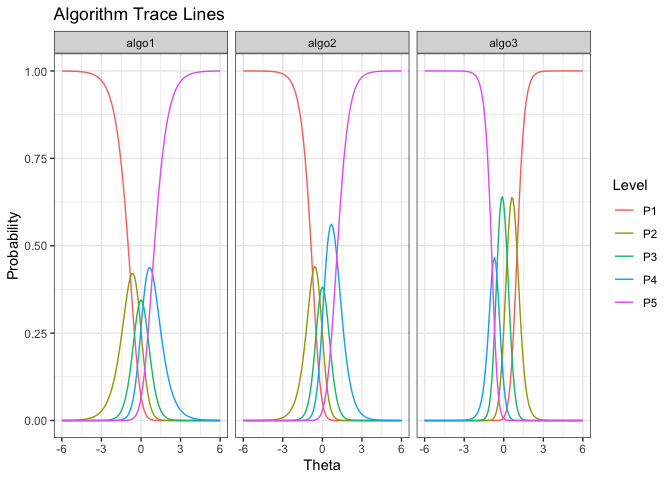

<!-- README.md is generated from README.Rmd. Please edit that file -->

# airt 

<!-- badges: start -->

[](https://travis-ci.org/sevvandi/airt)
<!-- badges: end -->

The goal of *airt* is to evaluate algorithm performances using Item
Response Theory (IRT). You can use *airt* to evaluate the performance of
a group of algorithms on a collection of test instances. The IRT model
is fitted using the R package **mirt** .

## Installation

<!-- You can install the released version of airt from [CRAN](https://CRAN.R-project.org) with: -->

<!-- ``` r -->

<!-- install.packages("airt") -->

<!-- ``` -->

You can install the development version from
[GitHub](https://github.com/) with:

``` r
# install.packages("devtools")
devtools::install_github("sevvandi/airt")
```

## Example

``` r
library(airt)
library(ggplot2)
set.seed(1)
algo1 <- sample(1:5, 100, replace = TRUE)
inds1 <- which(algo1 %in% c(4,5))
algo2 <- rep(0, 100)
algo2[inds1] <- sample(4:5, length(inds1), replace = TRUE)
algo2[-inds1] <- sample(1:3, (100-length(inds1)), replace = TRUE)
algo3 <- rep(0, 100)
algo3[inds1] <- sample(1:2, length(inds1), replace = TRUE)
algo3[-inds1] <- sample(3:5, (100-length(inds1)), replace = TRUE)
algorithms <- cbind.data.frame(algo1, algo2, algo3)
mod <- irtmodel(algorithms)
#> Iteration: 1, Log-Lik: -539.061, Max-Change: 1.21454Iteration: 2, Log-Lik: -434.043, Max-Change: 1.03064Iteration: 3, Log-Lik: -407.239, Max-Change: 0.78911Iteration: 4, Log-Lik: -400.194, Max-Change: 0.51251Iteration: 5, Log-Lik: -397.982, Max-Change: 0.33354Iteration: 6, Log-Lik: -397.157, Max-Change: 0.22781Iteration: 7, Log-Lik: -396.601, Max-Change: 0.10977Iteration: 8, Log-Lik: -396.515, Max-Change: 0.09151Iteration: 9, Log-Lik: -396.466, Max-Change: 0.07606Iteration: 10, Log-Lik: -396.384, Max-Change: 0.03591Iteration: 11, Log-Lik: -396.378, Max-Change: 0.03656Iteration: 12, Log-Lik: -396.373, Max-Change: 0.02963Iteration: 13, Log-Lik: -396.357, Max-Change: 0.03294Iteration: 14, Log-Lik: -396.354, Max-Change: 0.02403Iteration: 15, Log-Lik: -396.352, Max-Change: 0.02184Iteration: 16, Log-Lik: -396.348, Max-Change: 0.01044Iteration: 17, Log-Lik: -396.348, Max-Change: 0.01064Iteration: 18, Log-Lik: -396.348, Max-Change: 0.01132Iteration: 19, Log-Lik: -396.346, Max-Change: 0.01316Iteration: 20, Log-Lik: -396.346, Max-Change: 0.00796Iteration: 21, Log-Lik: -396.346, Max-Change: 0.00823Iteration: 22, Log-Lik: -396.345, Max-Change: 0.00348Iteration: 23, Log-Lik: -396.345, Max-Change: 0.00418Iteration: 24, Log-Lik: -396.345, Max-Change: 0.00264Iteration: 25, Log-Lik: -396.345, Max-Change: 0.00038Iteration: 26, Log-Lik: -396.345, Max-Change: 0.00021Iteration: 27, Log-Lik: -396.345, Max-Change: 0.00827Iteration: 28, Log-Lik: -396.345, Max-Change: 0.00096Iteration: 29, Log-Lik: -396.345, Max-Change: 0.00035Iteration: 30, Log-Lik: -396.345, Max-Change: 0.00086Iteration: 31, Log-Lik: -396.345, Max-Change: 0.00192Iteration: 32, Log-Lik: -396.345, Max-Change: 0.00308Iteration: 33, Log-Lik: -396.345, Max-Change: 0.00026Iteration: 34, Log-Lik: -396.345, Max-Change: 0.00024Iteration: 35, Log-Lik: -396.345, Max-Change: 0.00295Iteration: 36, Log-Lik: -396.345, Max-Change: 0.00035Iteration: 37, Log-Lik: -396.345, Max-Change: 0.00030Iteration: 38, Log-Lik: -396.345, Max-Change: 0.00018Iteration: 39, Log-Lik: -396.345, Max-Change: 0.00080Iteration: 40, Log-Lik: -396.345, Max-Change: 0.00061Iteration: 41, Log-Lik: -396.345, Max-Change: 0.00037Iteration: 42, Log-Lik: -396.345, Max-Change: 0.00020Iteration: 43, Log-Lik: -396.345, Max-Change: 0.00387Iteration: 44, Log-Lik: -396.345, Max-Change: 0.00442Iteration: 45, Log-Lik: -396.344, Max-Change: 0.00028Iteration: 46, Log-Lik: -396.344, Max-Change: 0.00026Iteration: 47, Log-Lik: -396.344, Max-Change: 0.00283Iteration: 48, Log-Lik: -396.344, Max-Change: 0.00040Iteration: 49, Log-Lik: -396.344, Max-Change: 0.00031Iteration: 50, Log-Lik: -396.344, Max-Change: 0.00021Iteration: 51, Log-Lik: -396.344, Max-Change: 0.00016Iteration: 52, Log-Lik: -396.344, Max-Change: 0.00246Iteration: 53, Log-Lik: -396.344, Max-Change: 0.00021Iteration: 54, Log-Lik: -396.344, Max-Change: 0.00077Iteration: 55, Log-Lik: -396.344, Max-Change: 0.00033Iteration: 56, Log-Lik: -396.344, Max-Change: 0.00015Iteration: 57, Log-Lik: -396.344, Max-Change: 0.00013Iteration: 58, Log-Lik: -396.344, Max-Change: 0.00508Iteration: 59, Log-Lik: -396.344, Max-Change: 0.00044Iteration: 60, Log-Lik: -396.344, Max-Change: 0.00013Iteration: 61, Log-Lik: -396.344, Max-Change: 0.00062Iteration: 62, Log-Lik: -396.344, Max-Change: 0.00041Iteration: 63, Log-Lik: -396.344, Max-Change: 0.00014Iteration: 64, Log-Lik: -396.344, Max-Change: 0.00065Iteration: 65, Log-Lik: -396.344, Max-Change: 0.00034Iteration: 66, Log-Lik: -396.344, Max-Change: 0.00012Iteration: 67, Log-Lik: -396.344, Max-Change: 0.00060Iteration: 68, Log-Lik: -396.344, Max-Change: 0.00028Iteration: 69, Log-Lik: -396.344, Max-Change: 0.00015Iteration: 70, Log-Lik: -396.344, Max-Change: 0.00059Iteration: 71, Log-Lik: -396.344, Max-Change: 0.00025Iteration: 72, Log-Lik: -396.344, Max-Change: 0.00017Iteration: 73, Log-Lik: -396.344, Max-Change: 0.00057Iteration: 74, Log-Lik: -396.344, Max-Change: 0.00024Iteration: 75, Log-Lik: -396.344, Max-Change: 0.00016Iteration: 76, Log-Lik: -396.344, Max-Change: 0.00056Iteration: 77, Log-Lik: -396.344, Max-Change: 0.00020Iteration: 78, Log-Lik: -396.344, Max-Change: 0.00013Iteration: 79, Log-Lik: -396.344, Max-Change: 0.00454Iteration: 80, Log-Lik: -396.344, Max-Change: 0.00034Iteration: 81, Log-Lik: -396.344, Max-Change: 0.00010Iteration: 82, Log-Lik: -396.344, Max-Change: 0.00054Iteration: 83, Log-Lik: -396.344, Max-Change: 0.00017Iteration: 84, Log-Lik: -396.344, Max-Change: 0.00060Iteration: 85, Log-Lik: -396.344, Max-Change: 0.00027Iteration: 86, Log-Lik: -396.344, Max-Change: 0.00012Iteration: 87, Log-Lik: -396.344, Max-Change: 0.00052Iteration: 88, Log-Lik: -396.344, Max-Change: 0.00040Iteration: 89, Log-Lik: -396.344, Max-Change: 0.00024Iteration: 90, Log-Lik: -396.344, Max-Change: 0.00013Iteration: 91, Log-Lik: -396.344, Max-Change: 0.00258Iteration: 92, Log-Lik: -396.344, Max-Change: 0.00091Iteration: 93, Log-Lik: -396.344, Max-Change: 0.00054Iteration: 94, Log-Lik: -396.344, Max-Change: 0.00021Iteration: 95, Log-Lik: -396.344, Max-Change: 0.00013Iteration: 96, Log-Lik: -396.344, Max-Change: 0.00010

gdf <- prepare_for_plots(mod$model)
ggplot(gdf, aes(Theta, value)) + geom_line(aes(color=Level)) + facet_wrap(.~Algorithm) + ylab("Probability") + ggtitle("Algorithm Trace Lines") + theme_bw()
```



``` r

mod$stability
#>     algo1     algo2     algo3 
#> 2.3694403 1.8929554 0.6127194

mod$anomalous
#> algo1 algo2 algo3 
#>     0     0     1
```

We see that *algo3* is anomalous. That is, it performs well on test
instances that others perform poorly. For *algo1* and *algo\_2*, the
highest level of performance P5 is achieved for high values of
\(\theta\). But for *algo3* the P5 is achieved for low values of
\(\theta\).

## More on *airt*

The pkgdown site describes the functionality of *airt* :
<https://sevvandi.github.io/airt/>.

## Acknowledgements

Firstly, thanks to Rob Hyndman for coming up with the name *airt*, which
is an old Scottish word meaing *to guide*. Also, a big thank you to
Patricia Menendez Galvan for patiently giving me feedback on how to
improve the hex sticker. Nishka and Sashenka Fernando also helped a lot
with the design of the hex sticker. Finally, where did I get the hex
sticker template from? From Emi Tanaka’s blogpost
<https://emitanaka.org/post/hexsticker/>. Thanks Emi.
